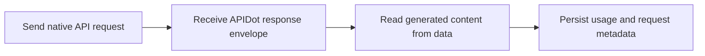

# Gemini 3 API with APIDot

Build with the Gemini 3 Series API using APIDot: cURL, Node.js, request variants, pricing, and production notes in one GitHub repo.

[Try on APIDot](https://apidot.ai/models/gemini-3) | [Get API Key](https://apidot.ai/dashboard/api-key) | [API Docs](https://apidot.ai/docs/gemini-3) | [Pricing](https://apidot.ai/pricing) | [Main Examples](https://github.com/APIDotAI/apidot-examples)

## Why this repo exists

Google's Gemini 3 chat model family for fast native Gemini responses, deeper reasoning, coding help, and multimodal-ready production chat workflows.

This repository turns that APIDot workflow into runnable server-side examples: a verified cURL request, a native Node.js example, request variants, pricing context, and production integration guardrails.

## Overview

Use this endpoint when your application already speaks Gemini Native format. The model ID is part of the path: call `/v1beta/models/gemini-3-flash-preview:generateContent` for Flash, or `/v1beta/models/gemini-3-pro-preview:generateContent` for Pro. For streaming, use the same model ID with `/v1beta/models/{model}:streamGenerateContent`.

## Capabilities

- Keep the model ID in the path and keep the body focused on Gemini Native fields such as `contents`, `systemInstruction`, and `generationConfig`.
- Use `gemini-3-flash-preview` for low-cost interactive traffic, then switch selected requests to `gemini-3-pro-preview` when reasoning depth or coding quality matters more.
- Read non-stream responses from `data.candidates` and `data.usageMetadata` because APIDot wraps Gemini Native responses in its standard response envelope.
- Only send backend-supported fields. Current validation covers `contents`, `systemInstruction`, `generationConfig`, `safetySettings`, `tools`, and `toolConfig`.

## Common use cases

- Product and marketing asset generation
- Backend media workflow prototypes
- Creative testing and prompt iteration
- Production integrations that need stable API examples

## Pricing on APIDot

Catalog price: Starting at 1 credits per 1K tokens | Flash input: 1 credit ($0.0004), Flash output: 5 credits ($0.0024), Pro input: 1 credit ($0.0008), Pro output: 5 credits ($0.0048).

| Tier | Model | Resolution | Credits | APIDot listed price | fal.ai listed price |
| --- | --- | --- | ---: | ---: | ---: |
| flash input tokens | gemini-3-flash-preview | - | 1 | $0.0004 | - |
| flash output tokens | gemini-3-flash-preview | - | 5 | $0.0024 | - |
| pro input tokens | gemini-3-pro-preview | - | 1 | $0.0008 | - |
| pro output tokens | gemini-3-pro-preview | - | 5 | $0.0048 | - |

This README uses pricing data currently published in the APIDot model catalog. Check the APIDot model page before high-volume production runs.

## Quick start

    cp .env.example .env
    # Edit .env and set APIDOT_API_KEY
    cd node
    npm start

The same request shape is available as a copy-paste cURL example in curl/generate.md.

## API workflow



Use this flow for native synchronous APIs. Keep API keys server-side, persist request metadata for support, and read generated content from the documented `data` object.

## Minimal API request

Submit to APIDot:

    POST https://api.apidot.ai/v1beta/models/gemini-3-flash-preview:generateContent
    Authorization: Bearer <APIDOT_API_KEY>
    Content-Type: application/json

Primary payload:

```json
{
  "contents": [
    {
      "role": "user",
      "parts": [
        {
          "text": "Write a concise launch checklist for a developer API that supports native Gemini requests."
        }
      ]
    }
  ],
  "systemInstruction": {
    "parts": [
      {
        "text": "You are a concise technical assistant."
      }
    ]
  },
  "generationConfig": {
    "temperature": 1,
    "maxOutputTokens": 1024,
    "topP": 0.95,
    "topK": 40
  }
}
```

Send native Gemini generateContent requests to Gemini 3 Flash Preview or Gemini 3 Pro Preview through APIDot.

## Model IDs and request variants

### gemini-3-flash-preview

```json
{
  "contents": [
    {
      "role": "user",
      "parts": [
        {
          "text": "Write a concise launch checklist for a developer API that supports native Gemini requests."
        }
      ]
    }
  ],
  "systemInstruction": {
    "parts": [
      {
        "text": "You are a concise technical assistant."
      }
    ]
  },
  "generationConfig": {
    "temperature": 1,
    "maxOutputTokens": 1024,
    "topP": 0.95,
    "topK": 40
  }
}
```

### gemini-3-pro-preview

```json
{
  "contents": [
    {
      "role": "user",
      "parts": [
        {
          "text": "Review this API integration plan and identify the highest-risk missing checks before production launch."
        }
      ]
    }
  ],
  "systemInstruction": {
    "parts": [
      {
        "text": "You are a senior API integration reviewer. Be specific and concise."
      }
    ]
  },
  "generationConfig": {
    "temperature": 0.8,
    "maxOutputTokens": 2048,
    "topP": 0.95,
    "topK": 40
  }
}
```

## Request parameters

| Field | Type | Required | Description |
| --- | --- | --- | --- |
| model | path string | yes | Model ID in the URL path. Use `gemini-3-flash-preview` or `gemini-3-pro-preview`. |
| method | path string | yes | Path method. Use `generateContent` for normal JSON responses or `streamGenerateContent` for SSE streaming. |
| contents | object[] | yes | Gemini Native conversation array. Each item includes a `role` and a `parts` array. |
| contents[].role | string | yes | Conversation role. Use `user` for user turns and `model` for prior assistant/model turns. |
| contents[].parts[].text | string | yes | Text content for a Gemini part. The current playground sends text parts. |
| systemInstruction | object | no | Optional Gemini system instruction object. Use `systemInstruction.parts[].text` to define assistant behavior. |
| generationConfig.temperature | number | no | Sampling temperature from 0 to 2. |
| generationConfig.maxOutputTokens | integer | no | Maximum output tokens to return. |
| generationConfig.topP | number | no | Nucleus sampling value from 0 to 1. |
| generationConfig.topK | integer | no | Top-K sampling value. Must be greater than or equal to 0. |
| generationConfig.stopSequences | string[] | no | Optional stop sequences that end generation when matched. |
| generationConfig.candidateCount | integer | no | Optional number of candidates to return. Backend validation allows values from 1 to 8. |
| safetySettings | object[] | no | Optional Gemini safety setting objects with `category` and `threshold`. |
| tools | object[] | no | Optional Gemini tool definitions passed through to the backend-supported native schema. |
| toolConfig | object | no | Optional tool configuration object. The backend currently accepts `function_calling_config`. |

## Practical integration notes

- Keep APIDot API keys in server-side environment variables.
- Persist selected model, request payload, user ID, and response metadata together.
- Validate source media URLs before submitting requests that depend on source files.
- Avoid logging API keys, private prompts, private media URLs, or callback URLs.
- Read generated content from the response data object and store usage metadata for cost review.

## Response and errors

- `code`: HTTP-style status code. Successful calls return `200`.
- `data`: Model-specific response body wrapped by APIDot.

Common error classes:

- `400 invalid_request`: Missing fields or unsupported parameter combinations.
- `401 authentication_error`: Missing, expired, or invalid Bearer API key.
- `402 insufficient_credits`: The current prepaid balance cannot cover the job.
- `429 rate_limited`: Request rate is temporarily above the current allowed limit.

## Example response

```json
{
  "code": 200,
  "data": {
    "candidates": [
      {
        "content": {
          "parts": [
            {
              "text": "Generated response text appears here."
            }
          ]
        }
      }
    ],
    "usageMetadata": {
      "promptTokenCount": 42,
      "candidatesTokenCount": 120,
      "totalTokenCount": 162
    }
  }
}
```

## Production notes

- Keep APIDot API keys in server-side environment variables.
- Persist selected model, request payload, user ID, and response metadata together.
- Validate source media URLs before submitting requests that depend on source files.
- Avoid logging API keys, private prompts, private media URLs, or callback URLs.
- Retry transient network failures with backoff, but do not retry unchanged invalid payloads.

## FAQ

### Which path should I call for Gemini 3 Flash?

Use `POST /v1beta/models/gemini-3-flash-preview:generateContent` for non-stream responses, or `POST /v1beta/models/gemini-3-flash-preview:streamGenerateContent` for streaming.

### Which path should I call for Gemini 3 Pro?

Use `POST /v1beta/models/gemini-3-pro-preview:generateContent` for non-stream responses, or `POST /v1beta/models/gemini-3-pro-preview:streamGenerateContent` for streaming.

### Does the request body include a `model` field?

No. In Gemini Native format the model is carried in the path. The request body starts with `contents` and may include optional native Gemini fields.

### Why is the response wrapped in `code` and `data`?

APIDot standardizes non-stream JSON responses. Use `data` as the Gemini response object. Streaming responses are delivered as server-sent events.

## Related links

- Website: https://apidot.ai
- Docs: https://apidot.ai/docs
- Gemini 3 Series docs: https://apidot.ai/docs/gemini-3
- Gemini 3 Series model page: https://apidot.ai/models/gemini-3
- GitHub repo: https://github.com/APIDotAI/gemini-3-api
- Main examples: https://github.com/APIDotAI/apidot-examples
